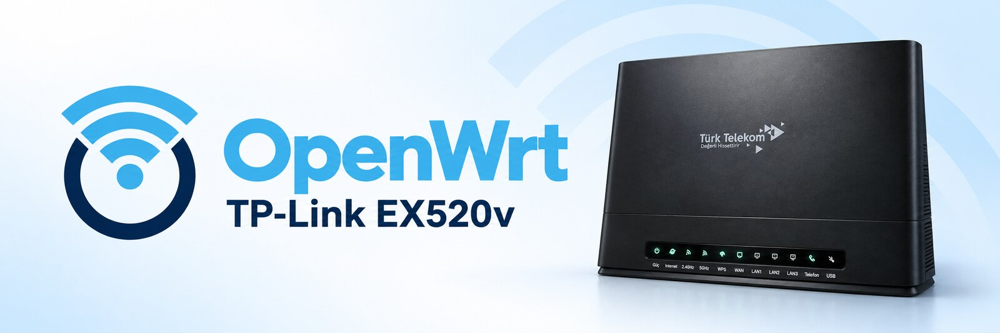
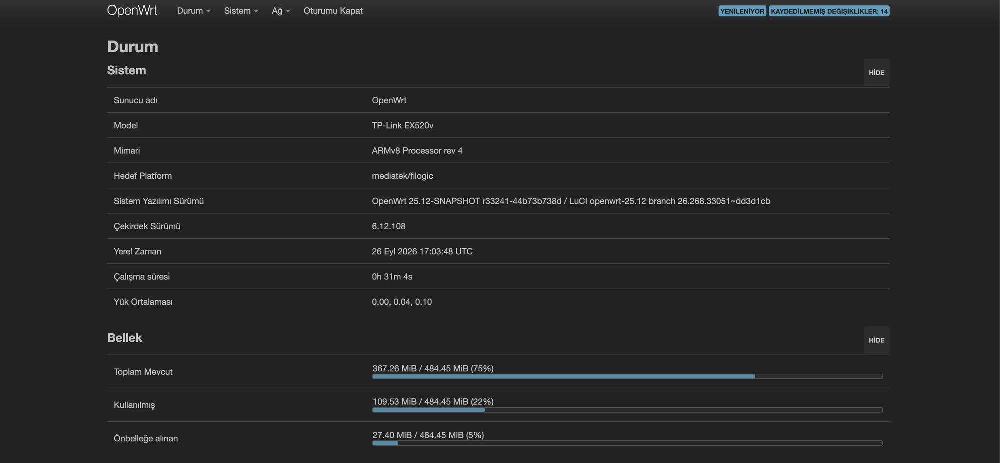

<p align="center">
  
</p>

# TP-Link EX520v için OpenWrt

Bu depoyla TP-Link EX520v'ye (Türk Telekom AX3000) OpenWrt kurabilirsin.
İmajı oluşturan her şey burada: OpenWrt kaynağı, cihaz desteği ve derleme
betikleri. Hazır imajları GitHub Actions derler, istersen sen de
derleyebilirsin.

**Arayüz Türkçe gelir.** Yönetim paneli (LuCI) ilk açılışta Türkçe açılır,
ayar yapmana gerek yok. İstersen Sistem → Sistem → Dil menüsünden değiştirebilirsin.

<p align="center">
  
</p>

> **Durum:** deneysel. Neyin denendiğini aşağıdaki listede görebilirsin.

## Neler çalışıyor

26 Eylül 2026'da çalışan bir cihazda denendi:

- [x] RAM'den deneme açılışı
- [x] Flash'tan açılış, ayarlar yeniden başlatmada korunuyor
- [x] Türk Telekom fiber: VLAN 35 üzerinden PPPoE, public IP ve DNS
- [x] Fabrika kalibrasyonuyla 2.4 GHz ve 5 GHz Wi-Fi
- [x] Türkçe yönetim paneli (LuCI)
- [x] Stok firmware'e geri dönüş
- [ ] LAN hızı, LED'ler, butonlar, USB (henüz denenmedi)

Telefon (FXS) portu çalışmaz.

## OpenWrt sürümü

İmajlar OpenWrt 25.12 (kernel 6.12) ile derlenir. 25.12, OpenWrt'nin en
güncel kararlı sürüm serisi. Taban olarak `openwrt-25.12` dalının 25 Eylül
2026 tarihli `44b73b7` commit'ini kullanıyoruz. Bu commit, v25.12.5'ten sonra
dala eklenen düzeltmeleri de içeriyor.

OpenWrt, kararlı dala yeni özellik eklemez. Bu dala yalnızca hata ve güvenlik
düzeltmeleri gelir. Stabilite ve güvenlik için en doğru seçim bu dal.

## İlk açılış

Wi-Fi ilk açılışta açık gelir, kablo gerekmez.

| | |
|---|---|
| Wi-Fi adı | `OpenWrt-EX520v` (2.4 GHz ve 5 GHz) |
| Wi-Fi parolası | `openwrt-ex520v` (WPA2) |
| Yönetim paneli | http://192.168.1.1 |
| root parolası | boş |

**Güvenlik:** Bu imajı kuran herkesin Wi-Fi adı ve parolası aynı. Kurulumdan
sonra ilk iş şunları değiştir:

1. Wi-Fi adı ve parolası: LuCI → Ağ → Kablosuz
2. root parolası: LuCI → Sistem → Yönetim

WAN, Türk Telekom fiber için hazır gelir (PPPoE, VLAN 35). LuCI → Ağ →
Arayüzler → WAN ekranında kullanıcı adını ve parolanı girmen yeterli.

## Başlamadan önce

Kuruluma geçmeden şunlara ihtiyacın var:

- **TP-Link EX520v router.** Bu imaj yalnızca bu modelde çalışır.
- **Stok firmware'de root SSH erişimi.** Kurulum betikleri router'a `root`
  olarak SSH ile bağlanıp flash'a yazar. Türk Telekom'un fabrika firmware'i
  bu erişimi vermez, bunu kendin sağlaman gerekir. Root erişimi olmadan bu
  yöntemi kullanamazsın. Alternatif, kasayı açıp seri konsol (UART)
  bağlamaktır; bu depo o yolu kullanmaz.
- **SSH'lı bir bilgisayar.** Linux ve macOS'ta `ssh` hazır gelir. Windows'ta
  PuTTY ya da WSL2 kullan. Router'a kablo ile bağlan, kurulum sırasında Wi-Fi
  kopabilir.
- **İki imaj dosyası.** `...-initramfs-kernel.bin` (deneme) ve
  `...-squashfs-sysupgrade.bin` (flash). Bunları [Releases](../../releases)
  sayfasından indir ya da kendin derle ([BUILD.md](BUILD.md)).

Root erişimin yoksa kuruluma başlama, aksi halde yarıda kalırsın.

## Kurulum

Kurulum, stok firmware'e root SSH ile bağlanmanı gerektirir. Seri konsol
(UART) gerekmez. OpenWrt, stok firmware'in yedek slotuna (`ubi0`) kurulur.
Stok firmware diğer slotta (`ubi1`) olduğu gibi kalır.

Adımlar tek tek ilerler. Her adımdan sonra router'ı kapatıp açmak seni stok
firmware'e döndürür, ta ki son adımda onaylayana kadar. Yani her aşamada geri
dönüş yolun var.

1. **Yedek al.** Bilgisayarında `install/backup-stock.sh` çalıştır. Betik tüm
   flash bölümlerini SSH ile indirir. Bu yedeği sakla, router'ın Wi-Fi
   kalibrasyonu ve MAC adresleri içinde.
2. **RAM'den dene.** Stok firmware'de `install/stock-install-trial.sh`
   çalıştır ve router'ı yeniden başlat. OpenWrt RAM'den açılır. Router'ı
   kapatıp açarsan stok firmware geri gelir.
3. **Flash'a yaz.** Deneme OpenWrt'sinde `install/openwrt-trial-to-flash.sh`
   çalıştır ve yeniden başlat. OpenWrt artık flash'tan açılır. Kapatıp açarsan
   yine stoka dönersin.
4. **Onayla.** Her şey çalışıyorsa `install/openwrt-confirm.sh` çalıştır.
   OpenWrt kalıcı olur.

Kurulumdan sonra Wi-Fi adını, Wi-Fi parolasını ve root parolasını değiştir
(bkz. [İlk açılış](#i̇lk-açılış)).

Stok firmware'e istediğin an dönebilirsin:

```sh
fw_setenv ex520v_trial; fw_setenv tp_boot_idx 1; reboot
```

**Risk:** Kernel, sistem başlamadan çökerse router OpenWrt'yi açmaya devam
eder. O durumda routerı yalnızca seri konsolla kurtarabilirsin. 2. adımdaki
deneme, bu hatayı flash'a kalıcı bir şey yazmadan yakalamak için var. Kurulum
bootloader'a (BL2, FIP, U-Boot) dokunmaz.

## Güven ve doğrulama

- **Açık ve küçük kaynak.** Cihaza özel kod `patches/` (~360 satır) ve
  `files/` klasörlerinde. Gerisi değiştirilmemiş OpenWrt.
- **Sabit kaynak.** `build.sh` OpenWrt commit'ini, `config/feeds.conf` paket
  commit'lerini sabitler. Her derleme aynı kaynaktan çıkar.
- **GitHub derler.** Hazır imajları GitHub Actions bu depodan derler, build
  log'unu herkes görebilir. GitHub her imaja bir attestation ekler. İmajın bu
  depodan derlendiğini `gh attestation verify` ile kontrol edebilirsin.
- **Kendin derle.** CI'ya güvenmek istemezsen imajı kendin derleyebilirsin:
  [BUILD.md](BUILD.md).

## Derleme

```sh
./build.sh
```

Gereksinimler, derleme adımları ve imaj doğrulama için [BUILD.md](BUILD.md).

## Teknik notlar

### Stok bootloader

- U-Boot, `tp_boot_idx` env değişkenine göre slot seçer: `1` ise `ubi1`, başka
  bir değer ya da boşsa `ubi0`.
- Seçilen slotta `uboot`, `kernel` veya `rootfs` volume'u eksik ya da bozuksa
  U-Boot diğer slota geçer. Kernel açılıp takılırsa geçmez. Açılış sayacı ve
  web kurtarma yok.
- İkinci U-Boot, imzasız FIT imajlarını açar.
- TP-Link'in güncelleme betiği (`/usr/bin/do_upgrade.sh`) pasif slota bu
  yöntemle yazar. Kurulum betikleri de aynısını yapar.
- Deneme modu stok firmware'de yok, onu bu depo ekliyor. `ex520v_trial=1`
  iken OpenWrt her açılışta `tp_boot_idx=1` yazar
  (`files/lib/preinit/05_ex520v_trial`). Böylece bir sonraki açılış stoka
  gider.

### Donanım

| | |
|---|---|
| SoC | MediaTek MT7981B, 2× Cortex-A53 |
| RAM | 512 MiB |
| Flash | 512 MiB Micron SPI-NAND, NMBM (son 128 blok) |
| Switch | MT7531, GMAC0 (2500base-x). lan1 = 3, lan2 = 2, lan3 = 1 |
| WAN | GMAC1, dahili GbE PHY |
| Wi-Fi kalibrasyonu | `misc_ro` UBIFS, `0x00440000` dosyası (ilk 4 KiB) |
| MAC tabanı | `misc_ro` UBIFS, `0x0038F1E0` dosyası. WAN +1, LAN +5, 2.4 GHz +6, 5 GHz +7 (stokla aynı) |

## Lisans

GPL-2.0-or-later, upstream OpenWrt ile aynı. Device tree:
GPL-2.0-or-later veya MIT.
